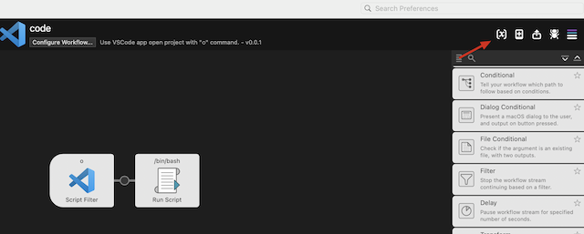
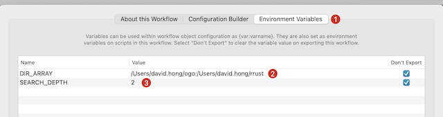

# Alfred Workflow: Open VSCode Projects

An Alfred workflow that helps you quickly open projects in Visual Studio Code using the "o" command.

## Features

- Quick project search and open with VSCode
- Configurable search root directories (supports multiple paths, use `:` to separate)
- Adjustable search depth to optimize performance
- Works with [Alfred 5](https://www.alfredapp.com/alfred-5-whats-new/)

## Prerequisites

- [Alfred Powerpack](https://www.alfredapp.com/powerpack/) (Required for workflows)
- [Visual Studio Code](https://code.visualstudio.com/)
- VSCode `code` command [installed in PATH](https://code.visualstudio.com/docs/setup/mac)

## Installation

1. Download [code.alfredworkflow](https://github.com/davidhong1/alfred-open-with-vscode-workflow/blob/main/code.alfredworkflow)
2. Double-click the downloaded file to install it in Alfred

## Configuration

1. Configure search directories:
   - Set `DIR_ARRAY` environment variable in Alfred
   - Multiple directories can be separated by colons (:)
   

2. Set search depth:
   - Configure `SEARCH_DEPTH` environment variable
   - Helps optimize search performance

3. Demo

## Usage

1. Trigger Alfred (default: ⌘ Space)
2. Type `o` followed by a space
3. Enter full or partial project name
4. Select desired project from results
5. Press Enter to open in VSCode

## Links

- [GitHub Repository](https://github.com/davidhong1/alfred-open-with-vscode-workflow)
